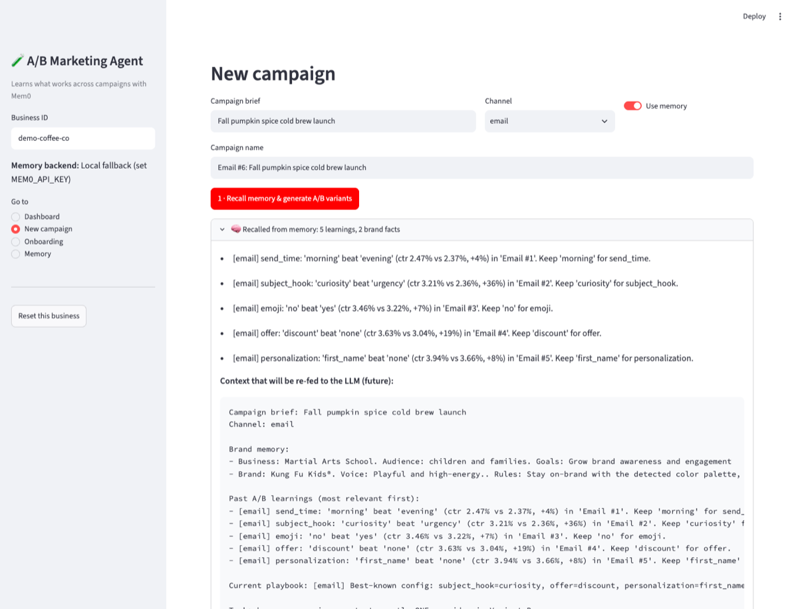
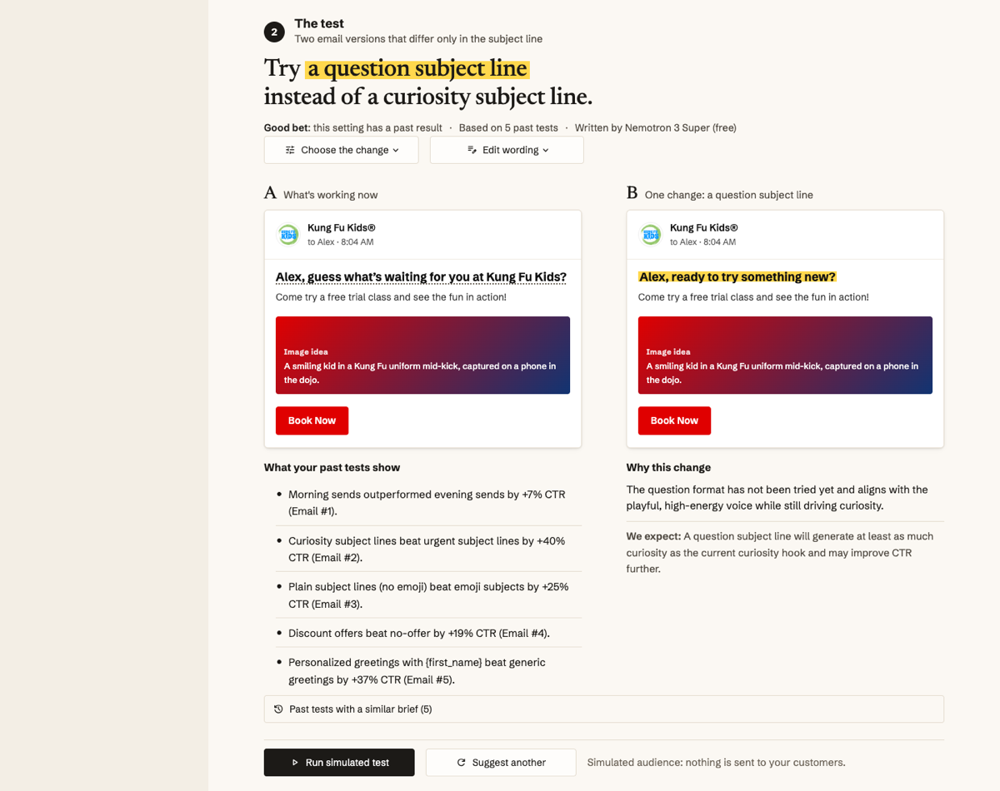
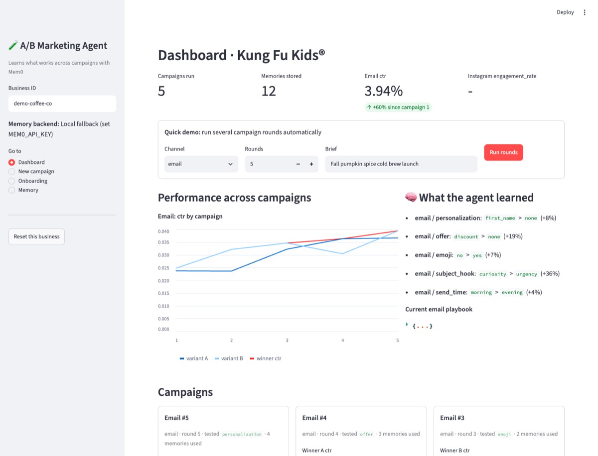
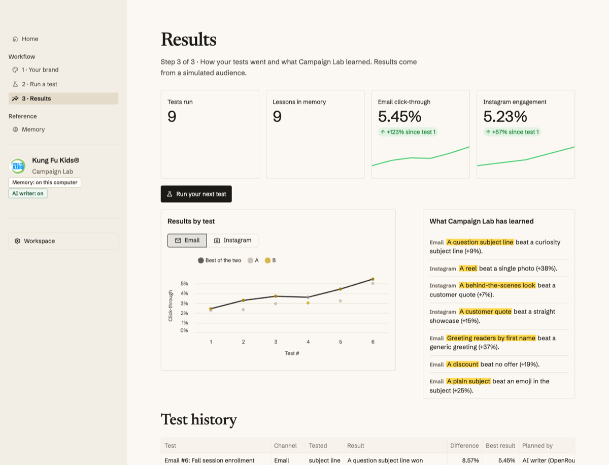
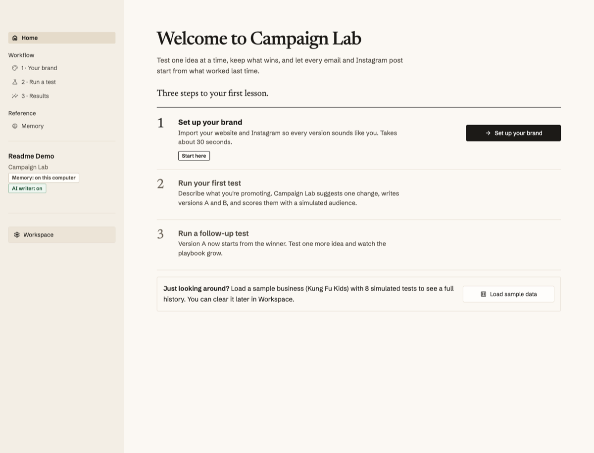
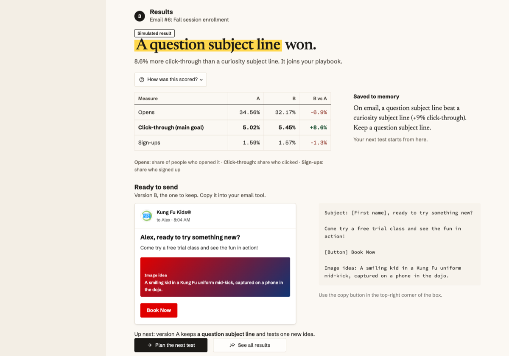

# Campaign Lab: an A/B marketing agent that remembers what works

> **About this fork.** This started as our team's buildathon project (The Gen Academy × Mem0 × SVAI, SF Tech Week, Oct 5 2026; theme: *Agents for small businesses*). The original repo is [GirikratnaSharma/mem0-ab-marketing-agent](https://github.com/GirikratnaSharma/mem0-ab-marketing-agent). After the event I forked it to keep going: to turn a working hackathon demo into something that feels like a finished product, and to fill in what we didn't get to, most importantly the LLM that actually reasons over past results.

Campaign Lab helps a small-business owner who does their own marketing decide what to send next. Before every email or Instagram post it recalls past A/B results from Mem0, suggests **one** change to test against what already works, writes both versions, and remembers the lesson afterwards, so every campaign starts smarter than the last.

## Before and after

| Buildathon version | This fork |
|---|---|
|  |  |
| **Planning a campaign.** Recalled records were printed as raw log lines, and the LLM was marked "(future)". | **Planning a test.** An AI strategist reads those records and recommends one change. The marker shows exactly what version B changes, in the business's own branded email. |
|  |  |
| **Dashboard.** Raw metric names (`ctr`, `engagement_rate`), code-styled lessons, the playbook as collapsed JSON. | **Results.** Plain-language lessons, a chart in the same visual language, and a clear next action. |

New in the fork:

| A guided first run | An honest, actionable result |
|---|---|
|  |  |
| Home walks a new user through three steps (brand → first test → follow-up test), with one "Start here" action and a one-click sample business. | A verdict labeled as simulated, A vs B numbers, the lesson saved to memory, and the winning version ready to copy. |

## What I added in this fork

**An AI strategist (the missing LLM).** In the buildathon version, the agent recalled past campaign records and printed them; the planning and copy were rule-based placeholders. Now an LLM reads the Mem0 recall plus the most similar past campaigns, explains what they show, picks the next test, and writes both versions as schema-validated JSON (`strategist.py`).
- Works with Claude through the Anthropic API, or through OpenRouter, which defaults to a free, zero-cost model (`nvidia/nemotron-3-super-120b-a12b:free`).
- Guardrails: the model can only choose from tests that haven't been tried, can't re-test a known loser, and must keep any offer the brief names. If it goes off the rails, a built-in strategist takes over and the UI says so.
- **Learning across businesses:** after a clear win, an anonymized lesson ("For a martial arts school serving children and families, on email, a question subject line beat an urgent subject line.") goes to a shared Mem0 shelf, with no brand name and no numbers. A new business's first tests use those lessons as hints, and the evidence says "Another business…". Your own results always come first.
- Plain-language lessons ("Greeting readers by first name beat a generic greeting (+19% click-through)") instead of raw log lines, which also gives the model better memory to reason over.

**Product and UX, designed with [Impeccable](https://impeccable.style).** I used the Impeccable design skill in Claude Code as a design director: `init` to write down who the product is for (`PRODUCT.md`), `critique` for scored UX reviews (two independent reviewers: a design review plus a detector and browser scan), then `clarify`, `harden`, `audit`, `bolder`, `adapt` and `polish` passes. The main flow (then called "Create campaign", now "Run a test") went from **19/40 to 23/40** on Nielsen's heuristics between the first two critiques, before a further round of fixes. Highlights:
- **A "proof sheet" identity** (paper and ink, Newsreader and Schibsted Grotesk) with a single yellow marker that has one job: showing exactly what version B changes, and what won.
- **A guided path for new users:** a Home page with a three-step checklist (set up your brand → run your first test → run a follow-up test) and a one-click sample business; numbered workflow pages in the sidebar (1 · Your brand, 2 · Run a test, 3 · Results); and every page ends by pointing to the next step. Once you're set up, Home becomes "your next test starts from N lessons".
- **A clear test page:** brief → the test (a serif one-line recommendation, the owner's own branded email or Instagram previews, the evidence behind it) → results (a verdict, A vs B table, the saved lesson, and the winning version ready to copy).
- **Honesty about simulation:** "Run simulated test", "Simulated result" tags, and a "too close to call" outcome when A and B land within 5%, so noise never gets stored as a rule.
- **Owner control:** choose the change yourself, edit the wording, get another suggestion, keep one saved plan per channel, and see what changed if the brief is edited.
- **Accessibility and mobile:** visible focus, labeled previews, readable brand colors (darkened automatically to pass WCAG contrast), 44px touch targets, and a sticky run bar on phones.

**Engineering.** Split the single Streamlit file into modules (`campaigns.py`, `onboarding.py`, `strategist.py`, `ui.py`), added drafts that survive a refresh, and grew the test suite from 9 to 32 offline tests (the LLM is mocked), plus live Mem0 tests.

## How it works
Start on **Home**: it shows the next step. No brand yet? **Load sample data** fills in a demo business so you can explore.
1. **Your brand:** import brand and business info from the website and Instagram → stored in Mem0
2. **Run a test:** the AI strategist reads what Mem0 recalls (past A/B lessons, brand facts) and similar past tests, recommends the ONE thing version B should change, and writes both versions. A simulated audience scores them; the lesson and updated playbook are written back to Mem0, and the winning version is ready to copy
3. **Results:** every test, what the agent has learned, and a with-vs-without-memory benchmark
4. **Next test** starts from the playbook, so results compound

Results come from a simulated audience with hidden preferences; nothing is sent to real customers yet. Real email and Instagram sending is the natural next step.

## Original buildathon team
- [@GirikratnaSharma](https://github.com/GirikratnaSharma)
- [@deepupai](https://github.com/deepupai)
- [@sakshamrai101](https://github.com/sakshamrai101)
- [@Ruta-U](https://github.com/Ruta-U) (this fork)

## Run it
```bash
python3.12 -m venv .venv && .venv/bin/pip install -r requirements.txt
cp .env.example .env   # add MEM0_API_KEY, plus ANTHROPIC_API_KEY or OPENROUTER_API_KEY
.venv/bin/streamlit run app.py
```

## Code map
- `app.py`: Streamlit app shell and pages (Home, 1 · Your brand, 2 · Run a test, 3 · Results, Memory)
- `strategist.py`: the AI strategist. Builds the prompt from Mem0 recall + similar past campaigns and asks the AI writer for insights, the next test, and copy for A/B (schema-validated JSON). Routes: Claude via the Anthropic API (`ANTHROPIC_API_KEY`), or OpenRouter (`OPENROUTER_API_KEY`, default model is the free `nvidia/nemotron-3-super-120b-a12b:free`; set `OPENROUTER_MODEL` to change it). Falls back to an offline strategist when neither works, and rejects any test outside the allowed options.
- `agent.py`: agent loop `recall -> plan -> simulate -> learn`, channel config, plain-language option labels, the simulated audience, and the offline template copywriter. `plan()` is the fast rule-based autopilot used by the demo tools and the benchmark.
- `campaigns.py`: campaign records (raw metrics), per-channel drafts, and one full test round
- `onboarding.py`: simulated website + Instagram scrape → business profile + brand kit
- `PRODUCT.md`: who the product is for and its principles (written with Impeccable's `init`). Critique snapshots live in `.impeccable/critique/`.
- `ui.py`: the "proof sheet" design system (paper/ink, a marker that highlights the one thing a test changes) and components: test statement, email / Instagram previews, results table, playbook strip. Theme fonts live in `.streamlit/config.toml`.
- Add `?debug=1` to the Run a test URL to see the exact context sent to the strategist.
- `memory_store.py`: the app's memory adapter (Mem0 + local JSON mirror/fallback) with both shelves: each business's private memory (`user_id`) and the shared agent shelf (`agent_id`, the same id `memory.py` uses).

## How Mem0 is used
- **Onboarding** writes brand info and business info to Mem0 (`kind=brand`).
- **Before each campaign** the agent searches Mem0 for brand facts + past A/B learnings for that channel, and the AI strategist turns them (plus similar past campaigns) into a recommendation.
- **After each test** the lesson ("A question subject line beat an urgent subject line (+23% click-through)") and the updated playbook are written back to Mem0, so the next campaign starts from what worked.
- **Across businesses:** clear wins are also written, anonymized, to the shared agent shelf. Before planning, the agent recalls lessons other businesses shared on the same channel (never its own) and uses them as hints. Resetting a business removes its shared lessons too. The Memory page lists them under "Learned from other businesses".
- **Memory ON vs OFF benchmark** on the dashboard shows the compounding effect.

## Memory (Mem0)
`memory.py` is the only file that talks to Mem0. Use `remember(business_id, exchange)` to store and `recall(business_id, query)` to read.

- `user_id` = one business (brand profile, what worked for them). Private to that business.
- `agent_id` = the marketing agent (general lessons). Shared across every business.

Setup:
```bash
pip install -r requirements.txt
cp .env.example .env          # add your MEM0_API_KEY
python setup_mem0.py          # once per Mem0 project: sets the extraction rules
python demo_memory.py         # business #2 recalls what business #1 learned
```
Keep raw metrics for the dashboard in the app's own store. Mem0 holds facts and lessons, not numbers.

Tests: `pytest` runs the Mem0 + simulated-data tests (`tests/test_mem0_simulated.py`), the strategist tests (`tests/test_strategist.py`, LLM mocked) and the cross-business tests (`tests/test_shared_lessons.py`). Live Mem0 tests run only when `MEM0_API_KEY` is set; `pytest -m "not live"` runs offline only.
